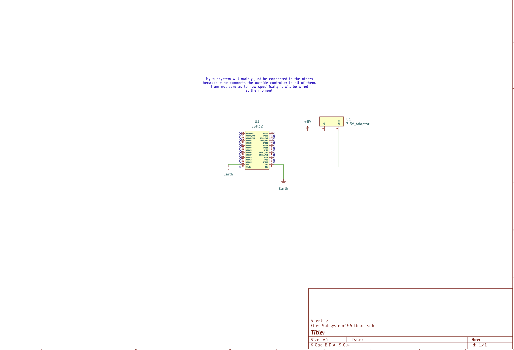

## Overview

This schematic is design to support communication from the other subsystems with the controller (which will likely be a computer).

{style width:"350" height:"300;"}

## Resouces

The schematic as a PDF download is available [*here*](Subsystem456.pdf), and the Zip folder of the project [*here*](Subsystem456.zip).
