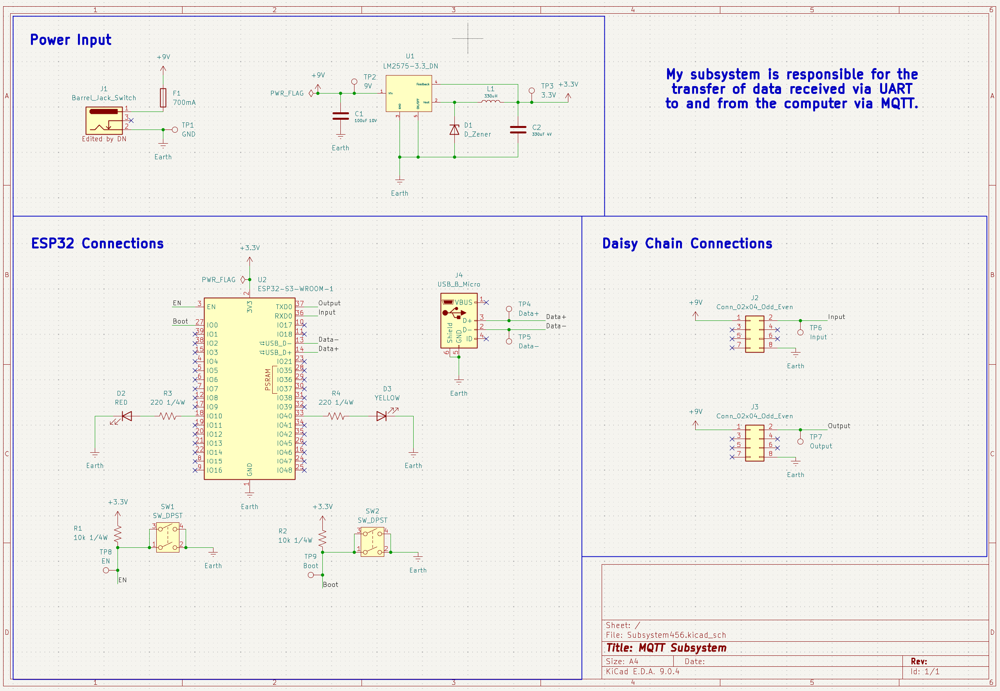

## Overview

This schematic is design to support communication from the other subsystems with the controller (which will likely be a computer).

## Resouces

The schematic as a PDF download is available [*here*](MQTT_Subsystem.pdf), and the Zip folder of the project [*here*](MQTT_Subsystem.zip).
