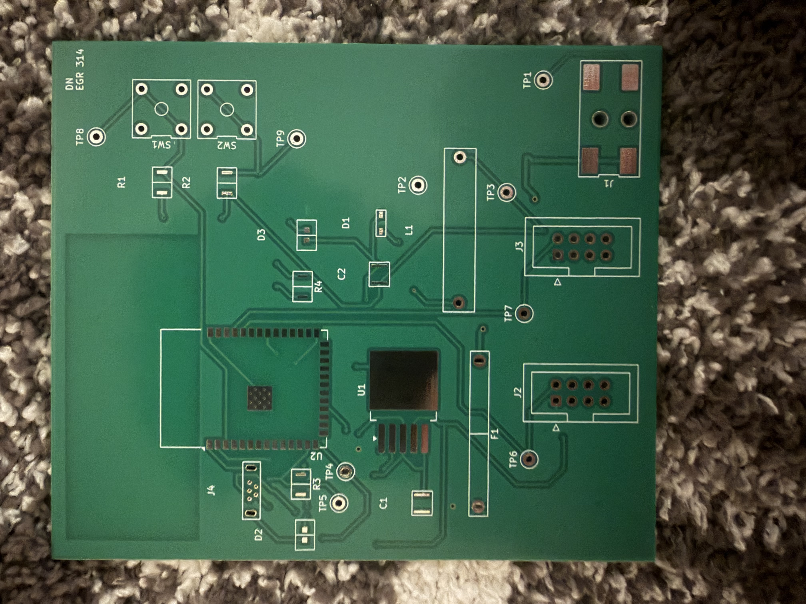
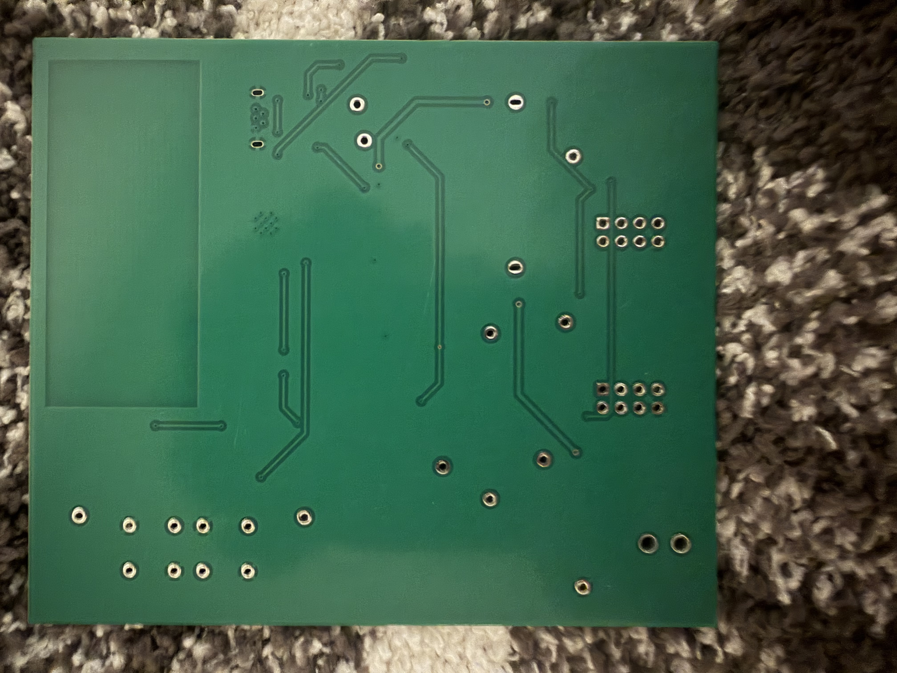
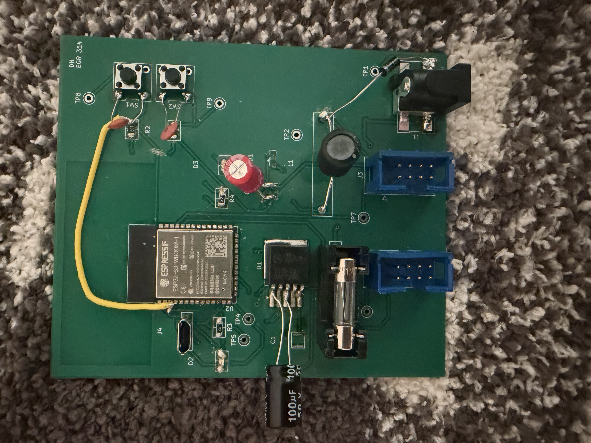
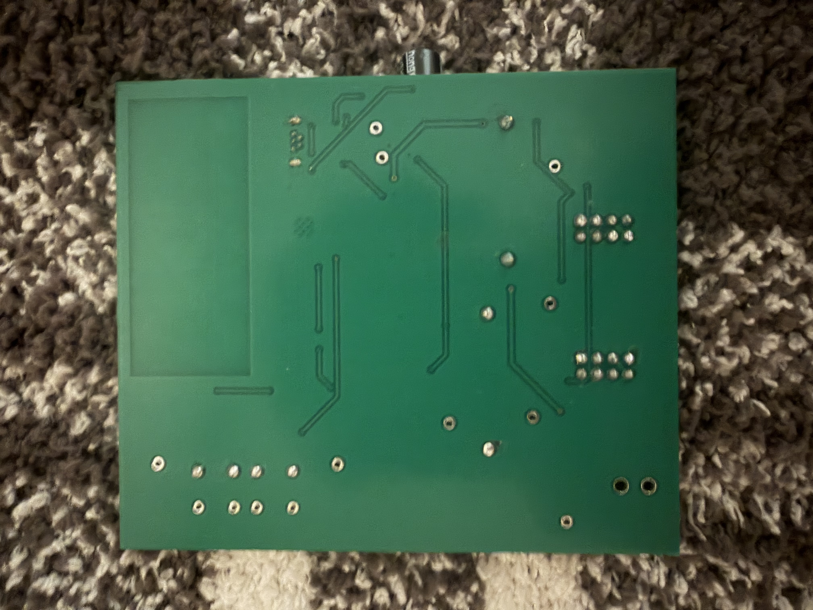
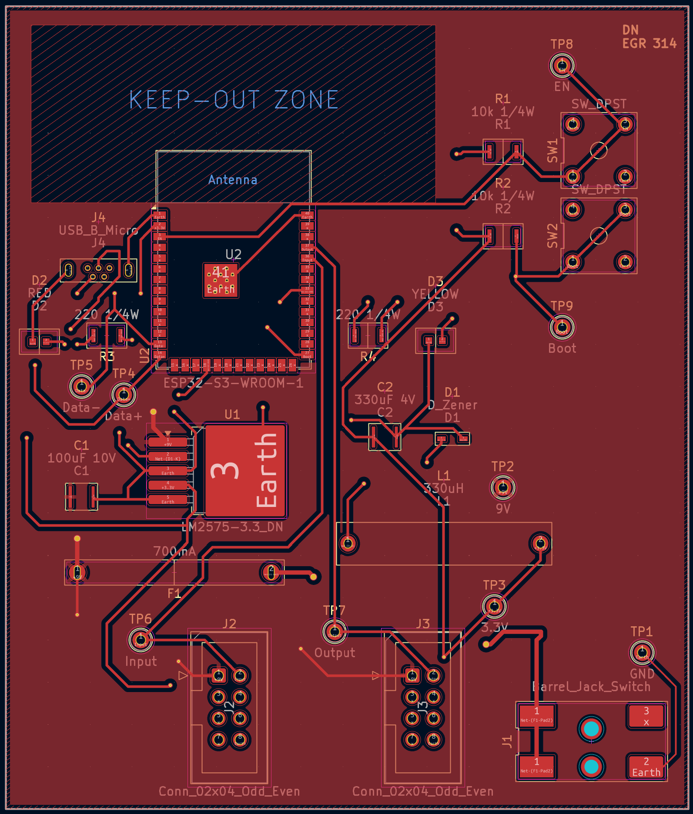
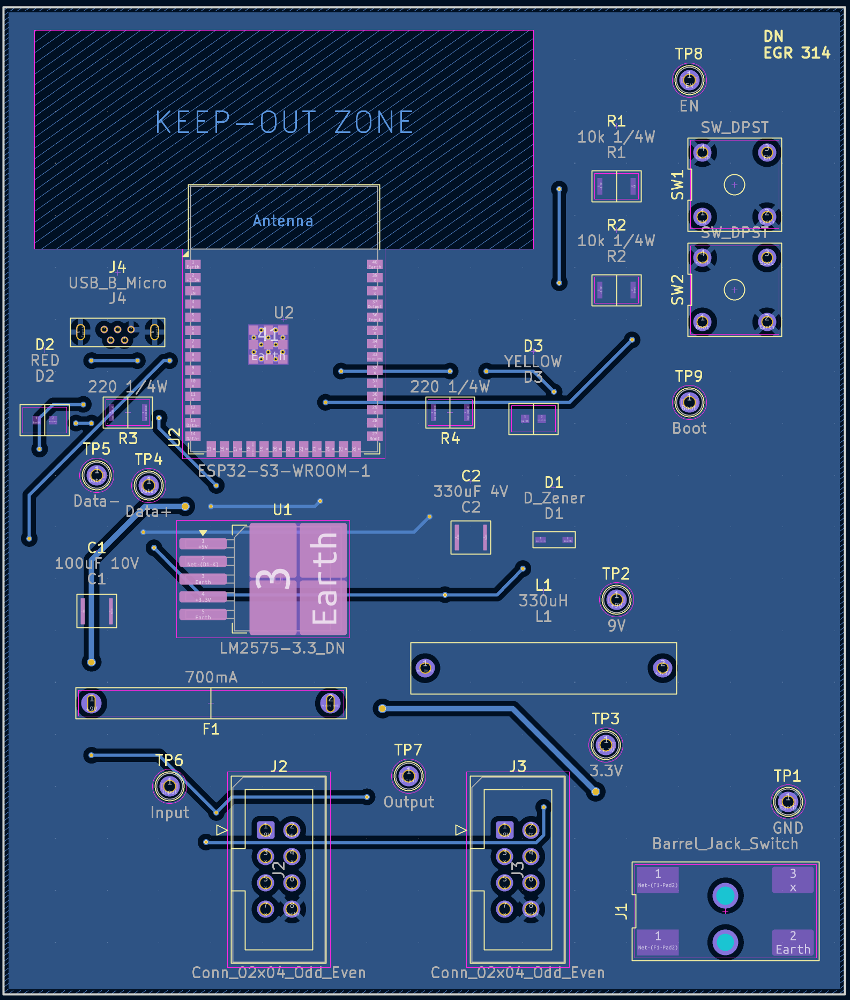

## PCB

### Pictures of Empty PCB

 

 

### Pictures of Final PCB

 

 

## ECAD

 

 

## Files

Download the project file [here](MQTT_Subsystem.zip).

Download the gerber files [here](MQTT_Gerbers.zip).
