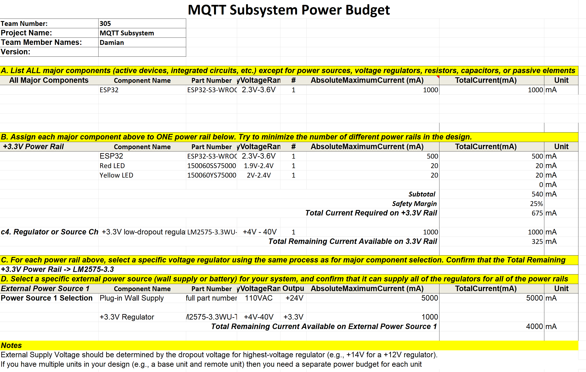

## Power Budget

## Conclusion

I used it to determine whether my components like the ESP32 and the LEDs will have enough voltage/current to operate. And I came to the conclusion that they would, as the ESP32 does not take up too much power.

Also, choosing a switching regulator was a good choice because a linear regulator wastes a lot more voltage through heat than a switching one does.

## Downloadables:

PDF of the power budget can be downloaded [here](MQTT_Subsystem_Power_Budget.pdf).

Original Excel file of the power budget can be downloaded [here](MQTT_Subsystem_Power_Budget.xlsx).
